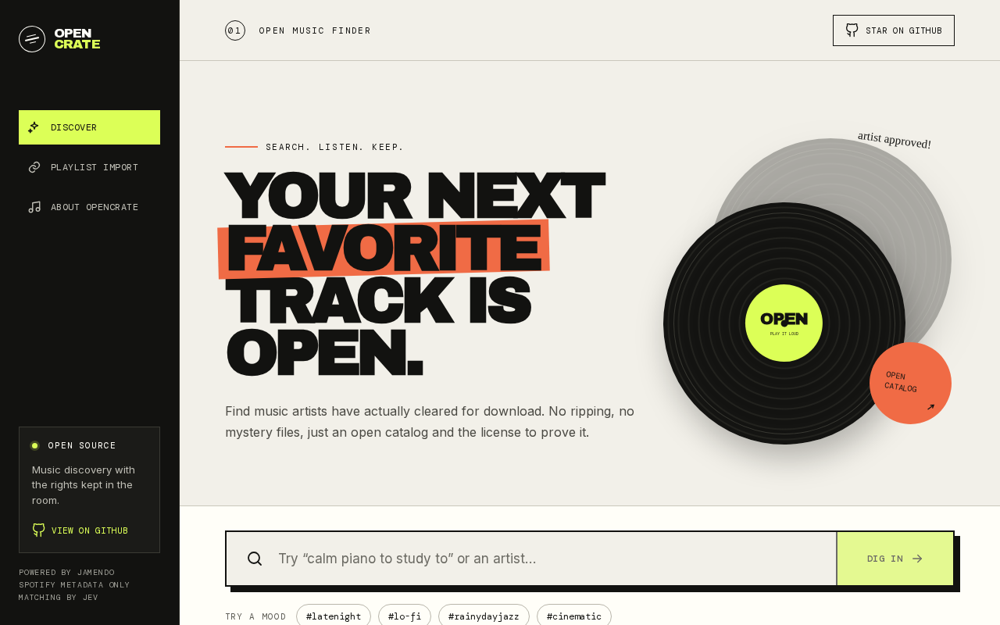
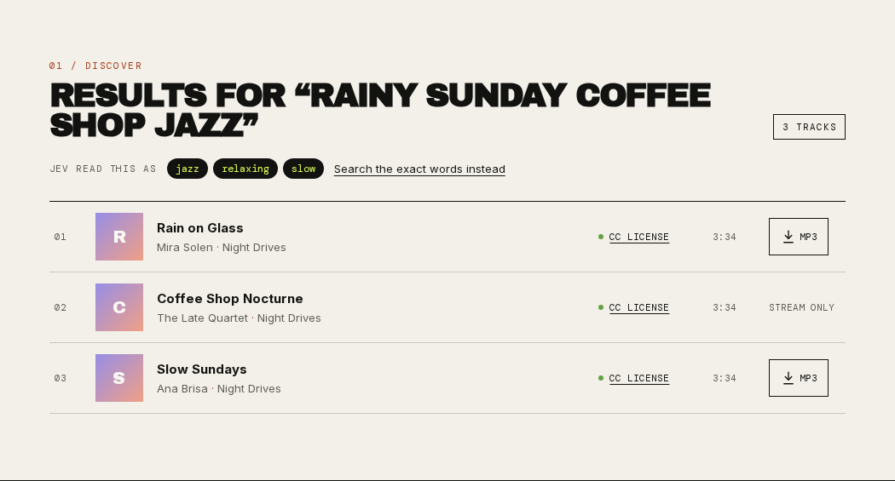
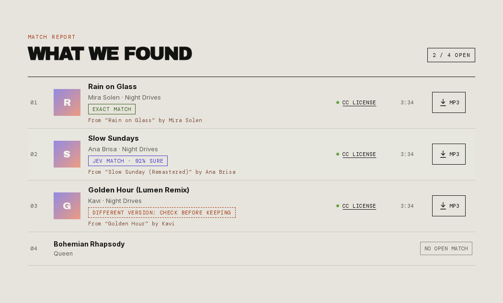

<div align="center">

# OpenCrate

**Find music that is free to keep.**

Search an open catalog, preview tracks, and download only what artists have cleared for download.
Bring a Spotify playlist or a plain track list and OpenCrate finds the open, downloadable versions.

[](https://github.com/aravmdn/opencrate/actions/workflows/ci.yml)
[](LICENSE)
[](https://nextjs.org)
[](#accessibility)



</div>

## Contents

- [Why OpenCrate](#why-opencrate)
- [Features](#features)
- [Quick start](#quick-start)
- [Configuration](#configuration)
- [How matching works](#how-matching-works)
- [Smart search and matching with Jev](#smart-search-and-matching-with-jev)
- [Accessibility](#accessibility)
- [Deploying](#deploying)
- [Privacy](#privacy)
- [Development](#development)
- [FAQ](#faq)
- [Contributing](#contributing)

## Why OpenCrate

Most "free music downloaders" rip audio from streaming services. OpenCrate does the opposite: it only
works with music whose artists have **explicitly allowed downloads**, and it shows you the license for
every track.

- **Audio source:** [Jamendo](https://www.jamendo.com), a large catalog of independent music released under Creative Commons licenses.
  A download button appears only when Jamendo reports `audiodownload_allowed: true`, and permission is
  checked again on the server right before every download.
- **Spotify is metadata only.** OpenCrate reads track names from your playlist to look for open versions.
  It never downloads, streams, or copies Spotify audio.

## Features

- **Search** by title, artist, genre, or mood, and preview tracks in the built-in player.
- **Download** artist-approved MP3s through Jamendo's official file endpoint, with the Creative Commons
  license linked on every result.
- **Match a playlist:** import up to 100 entries from a Spotify playlist you own or collaborate on, or
  paste a list of `Song — Artist` lines (no Spotify account needed).
- **Honest match report:** every result is labeled *Exact match*, *Jev match* (with confidence), or
  *Different version* (a remix, live take, or cover for you to check), and tracks with no open
  version are listed too.
- **Describe a vibe** (optional): with [Jev](#smart-search-and-matching-with-jev) enabled, a search like
  *"calm piano to study to"* becomes catalog filters (classical · relaxing · slow · instrumental).
- **Accessible:** keyboard and screen-reader friendly, AA color contrast, reduced-motion support, and a
  layout that works from phones to wide screens.
- **Self-hostable and private:** no accounts, no database, no analytics. Downloaded-track markers live
  only in your browser.

<details>
<summary>More screenshots</summary>

Search results for a mood query, showing Jev's interpretation (sample data):



A playlist match report with exact, Jev, different-version, and unmatched rows (sample data):



</details>

## Quick start

You need **Node.js 20.9 or newer** and a free **Jamendo client ID**.

```bash
git clone https://github.com/aravmdn/opencrate.git
cd opencrate
npm install
cp .env.example .env.local
```

1. Register an app at the [Jamendo developer portal](https://devportal.jamendo.com/) (free, about two
   minutes) and paste the client ID into `.env.local`:

   ```dotenv
   JAMENDO_CLIENT_ID=your_client_id
   ```

2. Start the app:

   ```bash
   npm run dev
   ```

3. Open **<http://127.0.0.1:3000>**.

Search, previews, text-list matching, and downloads now work. Spotify import and Jev are optional
and described below.

## Configuration

All configuration is through environment variables in `.env.local` (or your host's settings).

| Variable | Required | Enables |
| --- | --- | --- |
| `JAMENDO_CLIENT_ID` | **Yes** | Search, previews, matching, and downloads |
| `SPOTIFY_CLIENT_ID` | No | Spotify playlist import |
| `SPOTIFY_CLIENT_SECRET` | No | Spotify playlist import (server-side token exchange) |
| `TYPESAFE_API_KEY` | No | Jev-powered matching and vibe search |

Without the optional variables, the related features switch off cleanly: the interface explains what is
missing and offers the alternative (for example, pasting a track list instead of connecting Spotify).

`.env.local` is git-ignored. Never commit real credentials.

### Spotify import (optional)

1. Create a Web API app in the [Spotify developer dashboard](https://developer.spotify.com/dashboard).
2. Add this redirect URI to the app, exactly:
   `http://127.0.0.1:3000/api/spotify/callback`
   (Spotify rejects `localhost`; use the loopback IP locally and your real HTTPS origin in production.)
3. Add `SPOTIFY_CLIENT_ID` and `SPOTIFY_CLIENT_SECRET` to `.env.local` and restart the dev server.

Spotify's Web API only returns playlist items for playlists **you own or collaborate on**, and new apps
start in development mode, where only users you add in the dashboard can sign in. OpenCrate asks for
the read-only `playlist-read-private` scope and keeps the short-lived access token in an HTTP-only,
same-site cookie that client JavaScript cannot read. When it expires you are asked to reconnect.

### Jev (optional)

1. Create an API key in the [TypeSafe console](https://console.typesafe.ai).
2. Add it to `.env.local`:

   ```dotenv
   TYPESAFE_API_KEY=your_api_key
   ```

See [Smart search and matching with Jev](#smart-search-and-matching-with-jev) for what it does.

## How matching works

```text
 Spotify playlist or pasted list
            │  title + artist only
            ▼
 search Jamendo for candidates ──► drop tracks whose artist disabled downloads
            │
            ▼
 identical normalized title + artist? ── yes ──► Exact match
            │ no
            ▼
 Jev configured? ── no ──► no match (exact-only mode)
            │ yes
            ▼
 Jev judges each candidate:  different song │ different version │ same recording
                                   │                 │                    │
                              no match         "check before keeping"   Jev match
```

- **Rights come first, in code.** Download permission is filtered before any matching happens, and
  re-checked by `/api/catalog/download` right before redirecting to the file.
- **Exact matching** compares Unicode-normalized titles and primary artists, so accents,
  punctuation, and non-Latin scripts are handled, while "June Tribute" never matches "June".
- **OpenCrate prefers a missing match to a wrong one.** Without Jev, anything short of an exact match is
  reported as "No open match".

## Smart search and matching with Jev

[Jev](https://docs.typesafe.ai) is TypeSafe's System One model. It answers narrow questions with typed
answers and calibrated probabilities instead of generating text. OpenCrate uses it in two places, and
keeps every policy decision in its own code.

**Playlist matching** (`src/lib/jev.ts`, `src/lib/matching.ts`). When no candidate matches exactly, one
request asks Jev how each downloadable candidate relates to the playlist track, on a three-level scale:

| Level | Meaning | OpenCrate shows |
| --- | --- | --- |
| 0 | A different song, or an unrelated artist | No open match |
| 1 | The same song in another version: remix, live, acoustic, edit, cover, tribute | *Different version: check before keeping* |
| 2 | The same recording; differences are only formatting, featured-artist credits, or labels like *Remastered* or *Radio Edit* | *Jev match* with Jev's confidence |

The nearest level decides the outcome, so there is no hand-tuned threshold. Remixes and covers are never
auto-accepted: they are surfaced for you to preview and decide.

**Vibe search** (`/api/catalog/search`). One request asks whether the query names specific music or
describes a vibe, and in parallel which genre, mood, tempo, and vocal style it implies. A reading becomes
a Jamendo filter only when Jev's confidence is at least 0.5. Queries that name a song or artist, uncertain
readings (for example, *"late night"*), and filter combinations that find nothing all fall back to plain
text search. The results page shows what Jev understood and offers **Search the exact words instead**.

**Failure is graceful.** If the TypeSafe API is unreachable or rate-limited, matching falls back to exact
mode and search falls back to text search. An import never fails because of Jev.

## Accessibility

OpenCrate aims for **WCAG 2.2 Level AA**.

- A **skip link** to search, landmark regions, a logical heading outline, and lists for results.
- Every control is a native button, link, or form field with a descriptive accessible name
  (for example, "Play preview of Rain on Glass by Mira Solen").
- **Live regions** announce search results, import progress, and errors without moving focus.
- Links that open a new tab say so to screen readers.
- Text and focus indicators meet **AA contrast** on both the light and dark surfaces, and focus rings
  switch color to stay visible on dark sections.
- Mobile inputs use 16px text (no zoom-on-focus), controls meet the WCAG 2.2 target-size minimum, and
  `prefers-reduced-motion` turns off animation.

The interface is checked with [axe-core](https://github.com/dequelabs/axe-core) (WCAG 2.2 AA plus
best-practice rules) in every state (home, search results, match report) at desktop and mobile
sizes, with zero violations. If something gets in your way, please
[open an issue](https://github.com/aravmdn/opencrate/issues/new/choose).

## Deploying

OpenCrate is a standard Next.js app and runs anywhere Node.js does.

[](https://vercel.com/new/clone?repository-url=https%3A%2F%2Fgithub.com%2Faravmdn%2Fopencrate&env=JAMENDO_CLIENT_ID&envDescription=Free%20client%20ID%20from%20the%20Jamendo%20developer%20portal&envLink=https%3A%2F%2Fdevportal.jamendo.com%2F&project-name=opencrate&repository-name=opencrate)

Or on any server:

```bash
npm ci
npm run build
npm start          # serves on port 3000; set PORT to change it
```

Checklist for a public instance:

- Serve over **HTTPS** (the Spotify cookie is marked `Secure` automatically on HTTPS origins).
- Register `https://your-domain/api/spotify/callback` as a Spotify redirect URI.
- Add rate limiting at your edge or proxy. Every search and match calls Jamendo (and Jev, if enabled)
  with your credentials.
- Review [Jamendo's API terms](https://devportal.jamendo.com/), Spotify's developer terms, and TypeSafe's
  terms for your use case. Provider policies can change.

## Privacy

OpenCrate has no accounts, database, or analytics. What leaves your browser:

| Data | Sent to | When |
| --- | --- | --- |
| Search text, track titles and artists | Jamendo | Every search and match |
| Search text, track titles and artists | TypeSafe (Jev) | Only if `TYPESAFE_API_KEY` is set |
| Spotify sign-in | Spotify | Only when you choose to connect |

The Spotify access token stays in an HTTP-only cookie. The list of tracks you opened for download is
stored in your browser's `localStorage` and never sent anywhere.

## Development

```bash
npm run dev        # start the dev server on http://127.0.0.1:3000
npm run check      # lint + typecheck + tests
npm run build      # production build
```

Tests use Node's built-in test runner with mocked Jamendo, Spotify, and TypeSafe responses, so they need
no credentials and make no network calls. CI runs lint, typecheck, tests, and a production build on every
push and pull request.

### Project layout

```text
src/
├── app/
│   ├── page.tsx                  # reads which features are configured
│   └── api/
│       ├── catalog/search        # text or vibe search
│       ├── catalog/match         # playlist matching, 50 tracks per request
│       ├── catalog/download      # re-checks permission, then redirects to the file
│       └── spotify/*             # OAuth login, callback, status, import, logout
├── components/                   # MusicFinder, TrackRow, icons
└── lib/
    ├── jamendo.ts                # catalog client and exact matching
    ├── jev.ts                    # Jev questions and answers
    ├── matching.ts               # match policy: exact → Jev → fallback
    ├── spotify.ts                # playlist URL parsing and paging
    └── track-list.ts             # pasted-list parser
tests/                            # provider, Jev, and parser tests
```

### API

| Route | Method | Purpose |
| --- | --- | --- |
| `/api/catalog/search?q=…[&mode=text]` | GET | Search; `mode=text` skips Jev interpretation |
| `/api/catalog/match` | POST | `{ tracks: [{ title, artist }] }` (up to 50) → match results |
| `/api/catalog/download?id=…` | GET | Re-checks permission, then 307 to Jamendo's file |
| `/api/spotify/login` | GET | Starts OAuth (state-checked) |
| `/api/spotify/import?url=…` | GET | Reads up to 100 playlist entries |
| `/api/spotify/status` / `logout` | GET / POST | Connection state / disconnect |

## FAQ

**Can OpenCrate download songs from Spotify?**
No, by design. Spotify audio is DRM-protected and its terms prohibit downloading. OpenCrate only reads
track names, then looks for the same recordings where the artist has allowed downloads.

**Why do so few of my playlist tracks match?**
Most major-label music is not released under open licenses. OpenCrate shines with independent,
Creative Commons, and royalty-free music. Unmatched tracks are listed so you know what is not available.

**Why "Connect & import" instead of reading any public playlist?**
Spotify's current Web API only returns items for playlists the signed-in user owns or collaborates on.
If you cannot connect, use **Paste a track list instead**.

**What does Jev cost?**
Jev is billed per input token by TypeSafe. A vibe search uses about 800 tokens, and matching a track that
has no exact match uses roughly 450–2,000, depending on how many candidates it checks (up to 10). See
[TypeSafe's models page](https://docs.typesafe.ai/models) for current pricing and limits.

## Contributing

Contributions are welcome. Please read [CONTRIBUTING.md](CONTRIBUTING.md) and our
[Code of Conduct](CODE_OF_CONDUCT.md). New audio sources must expose explicit download permission or a
compatible license; stream ripping and DRM workarounds are out of scope.

Found a security issue? See [SECURITY.md](SECURITY.md).

## License

[MIT](LICENSE) © 2026 Arav Madan. Music found through OpenCrate is licensed by its artists; check each
track's license before reuse.
